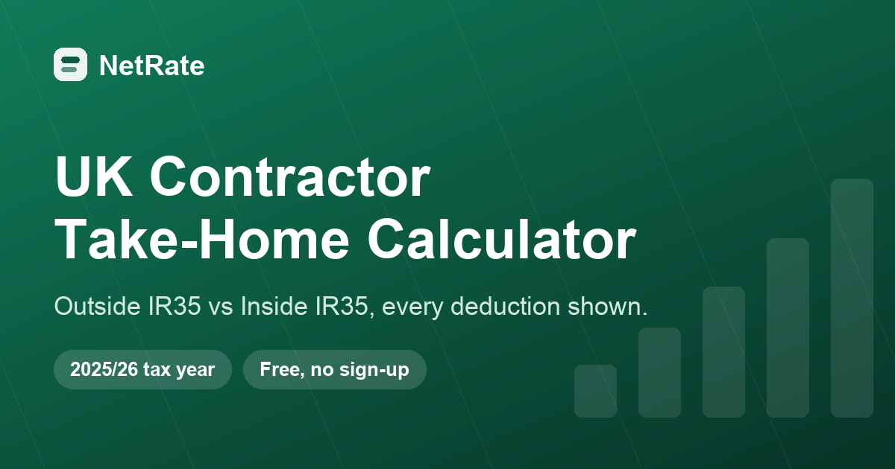

# NetRate — UK Contractor Take-Home Calculator

A free, client-side calculator that compares a UK contractor's take-home pay **outside IR35** (through a personal limited company) and **inside IR35** (through an umbrella company), with every deduction shown. Built for the **2025/26** tax year, rest of UK.

**Live:** https://billyzhonguom.github.io/uk-contractor-calculator/



## Why this one is different

Most contractor calculators are lead-generation forms for accountancy firms: they hide the employment costs, gate the result behind an email address, or only show one route. NetRate does the opposite.

- **Full transparency.** It shows the complete waterfall, including the employer National Insurance and apprenticeship levy that come out of an umbrella assignment rate before you are paid. That is the single thing contractors are most confused about.
- **Both routes, side by side.** Outside IR35 (limited company) and inside IR35 (umbrella) in one view, with the yearly and monthly gap.
- **No sign-up, no email gate, no tracking wall.**
- **Adjustable assumptions.** Director's salary strategy, business expenses, employer pension, umbrella margin, salary-sacrifice pension, student loan plans, and a separate rate for the inside-IR35 role.
- **A reality check.** It converts your contractor take-home into the equivalent permanent salary, so you can compare like with like.
- **Shareable and printable.** Every input is captured in the URL, and the result prints to a clean one-page PDF.

## What it models (2025/26, rest of UK)

| Area | Figures used |
|------|--------------|
| Income tax | Personal allowance £12,570 (tapered above £100,000); 20% to £50,270, 40% to £125,140, 45% above |
| Employee NI | 8% between £12,570 and £50,270, 2% above |
| Employer NI | 15% above the £5,000 secondary threshold (Employment Allowance not applied to a single-director company) |
| Dividends | £500 allowance, then 8.75% / 33.75% / 39.35%, taxed as the top slice |
| Corporation tax | 19% to £50,000, 25% above £250,000, marginal relief (3/200) between |
| Apprenticeship levy | 0.5% |
| Student loan | 9% above the plan threshold (Plan 1 £26,065, Plan 2 £28,470, Plan 4 £32,745, Plan 5 £25,000); Postgraduate 6% above £21,000 |

Scotland has different income-tax bands and is not yet covered. VAT is left out because for most contractors it is collected from the client and passed to HMRC, so it does not change take-home.

## Accuracy

The calculation engine ([`engine.js`](engine.js)) is a pure module with no UI dependencies, unit-tested against hand-worked examples ([`test.mjs`](test.mjs), 32 assertions). The umbrella inversion is checked for exact reconciliation: gross pay plus employer NI plus levy plus margin equals the assignment rate to the penny. The tax logic was also independently reviewed for 2025/26 correctness, which caught and fixed a student-loan edge case (multiple undergraduate plans are a single 9% deduction on the lowest threshold, not two stacked deductions).

It remains a **planning estimate, not tax advice**, and does not capture every personal circumstance.

## Tech

No framework and no build step. Plain HTML, CSS and a small ES module that the browser loads directly, so it deploys to any static host.

```
index.html      structure, copy, SEO metadata, structured data
styles.css      design tokens, light and dark mode, print styles
engine.js       the tax engine (pure, testable, importable)
app.js          UI wiring, charts, count-up, URL state, theme, print
test.mjs        node test harness for the engine
assets/         favicon, Open Graph image (+ make_og.py generator)
serve.py        local dev server only (threaded, no-store); not used in production
```

## Run locally

```bash
# tests
node test.mjs

# preview (any static server works)
python3 serve.py        # then open http://localhost:8200
```

## Deploy (GitHub Pages)

The repository root is the site root. Pushing to `main` rebuilds the page. `.nojekyll` is present so every file is served as-is.

## Monetisation

This is the first in a portfolio of free interactive tools. The business model (display ads, affiliate partnerships, optional pro export) and where each slot lives are documented in [MONETISATION.md](MONETISATION.md). Ad and affiliate slots are built in but inert until real accounts are wired, and they never change the numbers shown to the user.

## Disclaimer

NetRate gives an estimate for general guidance only. It is not financial, tax or legal advice, and figures may not reflect your full circumstances. Always confirm anything important with a qualified accountant.

## Licence

MIT. See [LICENSE](LICENSE).
